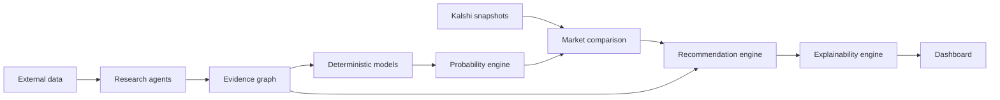

# Quantitative Sports Trading Platform

This repository is a first-version production scaffold for an evidence-first quantitative sports trading platform focused on FIFA World Cup prediction markets on Kalshi.

It is not an LLM betting assistant. LLM-capable agents are restricted to evidence collection, extraction, verification, contradiction detection, and explanation. Deterministic statistical code owns probability estimation, simulation, expected value, Kelly sizing, risk, and recommendation gates.

## What Is Included

- FastAPI backend with typed domain schemas
- Research agent framework and coordinator
- Evidence graph schema
- Elo and Poisson probability models
- Bayesian goal-shift updater
- Weighted ensemble model
- Reproducible Monte Carlo simulator
- Kalshi market snapshot client
- Recommendation engine with rejection policy
- Explainability engine
- Next.js, React, TypeScript, Tailwind dashboard
- PostgreSQL and Redis Docker Compose stack
- Backend tests and CI workflow
- Architecture, API, data model, and deployment docs
- Mock and credential-gated historical replay tooling

## Repository Layout

```text
backend/
  app/
    agents/        Research agents that produce structured evidence
    api/           FastAPI routes
    core/          Settings
    db/            SQL schema
    domain/        Pydantic contracts
    ingestion/     Kalshi and provider clients
    models/        Deterministic statistical models
    services/      Confidence, recommendation, explainability
  tests/
frontend/
  app/             Next.js app router
  components/      Dashboard components
  lib/             API client and shared types
docs/
tools/
  hydrate_partition_from_apifootball.py  Credential-gated real feature hydrator
  audit_backtest_ledger.py               Prints executed positions from a replay JSON
```

## Architecture



## Run Locally

```bash
cp .env.example .env
docker compose up --build
```

Then open:

- Dashboard: `http://localhost:3000`
- API docs: `http://localhost:8000/docs`

## Backend Without Docker

```bash
cd backend
python -m venv .venv
. .venv/bin/activate
python -m pip install -r requirements.txt
PYTHONPATH=. uvicorn app.main:app --reload
```

Run tests:

```bash
cd backend
PYTHONPATH=. pytest
```

## Historical World Cup Replay Data

The checked-in `data/world_cup_2026_jun11_jun28/` partition is a mock sandbox partition for validating replay mechanics, totals, ledger auditing, and portfolio covariance filtering.

For production hydration, set provider credentials and run:

```bash
set APIFOOTBALL_API_KEY=...
set APIFOOTBALL_WORLD_CUP_LEAGUE_ID=...
python tools/hydrate_partition_from_apifootball.py
```

The APIFootball path fetches fixtures for June 11 through June 28, 2026, requires the full 73-match slice, maps provider fixtures back to discovered Kalshi rows, and derives rolling team form only from completed fixtures strictly before each `as_of` cutoff. If credentials, fixture coverage, or Kalshi mapping are incomplete, it writes `data/world_cup_2026_jun11_jun28_real/hydration_status.json` with a blocked status instead of overwriting replay inputs.

Audit an executed replay ledger:

```bash
python tools/audit_backtest_ledger.py path/to/backtest.json
```

## Safety and Modeling Rules

- Research agents never predict outcomes.
- LLMs never estimate probabilities, expected value, Kelly fractions, or simulation results.
- Every evidence item preserves source, timestamp, credibility, confidence, facts, reasoning, links, and contradictions.
- Recommendation output must be reproducible from stored evidence, model outputs, and market snapshots.
- Confidence is capped below 100 percent.
- Rejected opportunities are first-class outputs and include reasons.

## Next Production Steps

- Load real timestamped historical data and run `/api/backtests/sample` as the template for full replay validation.
- Add authenticated Kalshi trading API calls only after compliance review.
- Replace sample endpoints with scheduled ingestion workers.
- Add provider-specific adapters for licensed football data.
- Persist every model input and output with code version metadata.
- Add calibration backtests before enabling live recommendation alerts.
