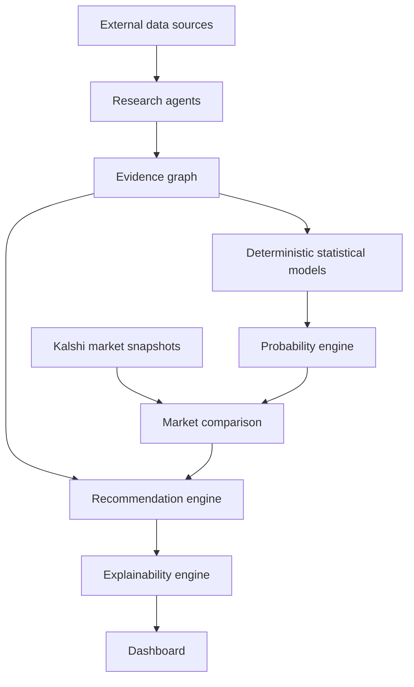

# Architecture

Research agents collect and verify structured evidence. They do not predict winners, estimate probabilities, calculate expected value, compute Kelly sizing, or run simulations.

Statistical models own probabilities. The first version includes Elo, Poisson goals, Bayesian goal shifts, weighted ensembling, and reproducible Monte Carlo simulation.

The recommendation engine consumes model output, evidence quality, market pricing, liquidity, spread, and contradictions. It rejects opportunities that fail policy gates.

The explainability engine renders existing evidence and quantitative outputs. It does not introduce new reasoning or change recommendations.
